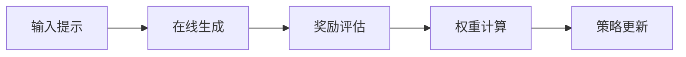

# [2605.05040] Preference-Based Self-Distillation: Beyond KL Matching via Reward Regularization

**Authors**: Xin Yu, Liuchen Liao, Yiwen Zhang, Yingchen Yu, Lingzhou Xue, Qinzhen Guo
**Year**: 2026 | **Venue**: arXiv
**Survey cite key**: `pbsd2026`
**URL**: https://arxiv.org/abs/2605.05040
**Last read**: 2026-05-08T15:55:45Z

---

## TL;DR
- **Problem**: 解决大模型同策略蒸馏中依赖**KL散度匹配**导致的**偏好不对齐**及继承教师**事实幻觉**的问题。
- **Method**: 提出结合**奖励正则化**的**基于偏好的自蒸馏**，利用**奖励模型**的分差构建动态权重引导梯度更新。
- **Result**: 有效缓解**奖励过度优化**，提升**长文本生成**的偏好满足率（摘要未提供具体数字和benchmark）。

## Core Contribution
本文针对大语言模型蒸馏中传统**KL散度匹配（KL Matching）**导致学生模型继承教师长尾**事实幻觉**的问题，提出了一种结合**奖励正则化（Reward Regularization）**的**基于偏好的自蒸馏**方法。该方法摒弃了盲目的分布匹配，通过在线生成候选轨迹并调用**奖励模型（Reward Model）**评估偏好，利用**奖励分差**构建动态权重，赋予高奖励轨迹更大梯度进行**策略梯度更新**。这一机制有效弥合了分布匹配与**奖励最大化**的错位，避免了标准强化学习易引发的**奖励过度优化**，显著提升了模型的对齐生成质量（摘要未提供具体量化数字）。

## Pipeline
1. **在线生成** — 模型根据输入在线生成多条候选回复轨迹
1. **奖励评估** — 调用奖励模型（Reward Model）评估各候选轨迹的偏好得分
1. **权重计算** — 摒弃传统KL匹配，利用轨迹间的奖励分差构建动态正则化权重
1. **策略更新** — 对高奖励轨迹赋予更大梯度，通过策略梯度更新模型参数

## Experiments
- **Benchmarks**: 摘要未提供
- **Key Result**: 摘要未提供具体数字
- **Vs. Baseline**: 摘要未提供具体提升幅度

## Review (reviewer style)
- **Score**: 6/10 | **Decision**: Weak Accept
- **Strengths**:
  - 动机精准，敏锐指出了传统同策略蒸馏中单一KL散度匹配在长尾分布下导致错误传递（如幻觉）的根本痛点
  - 方法设计巧妙，将奖励信号作为正则化项嵌入自蒸馏，有效缓解了标准RLHF中常见的奖励过度优化和模式单一化问题
- **Weaknesses**:
  - 摘要未提供具体的实验结果、对比baseline及量化提升幅度，无法评估其在主流Benchmark上的实际竞争力
  - 在线生成多条回复并频繁调用奖励模型评估，相比传统蒸馏会引入显著的额外计算开销，论文需说明其训练效率
- **One-liner**: 将奖励机制动态融入自蒸馏的思路具有启发性，能有效克服传统KL匹配的痛点，但需补充详实的量化评估和训练成本分析。

---

## 🧭 OPD Classification
**V2 section**: §4.2 Adaptive Divergence + §4.3 RL-Augmented + §5.3.2 Self-Play + §5.3.3 External Feedback

### OPD Relation
- **sampling_side**: on-policy
- **teacher_signal**: reward
- **divergence**: adaptive
- **teacher_arch**: self
- **novelty_focus**: objective

## 💡 Idea Hooks
- hook1: 引入过程监督(PRM)替代全局标量Reward进行Token-level的自蒸馏权重分配。Why: 论文提到单步全局奖励在多轮/长文本中存在信用分配困难，结合PRM可以实现更细粒度的Token-level的自适应发散度(Adaptive Divergence)控制，解决长尾幻觉剔除问题。
- hook2: 探索Reverse-KL与Reward Regularization的动态Curriculum调度(先KL后Reward)。Why: 论文完全摒弃了KL匹配，但纯奖励驱动在早期极易崩溃或导致模式崩塌。设计一个随训练步数衰减KL权重、增加Reward分差权重的调度策略，能在保证分布稳定的同时提升最终对齐上限。
- hook3: 设计异步采样与RM打分的System-Level优化(结合§6.3 Compute Optimization)。Why: 论文的致命伤在于在线生成多条轨迹并调用独立RM导致显存和计算爆炸。可以设计一套off-policy buffer配合on-policy小批量采样的混合架构，或引入轻量化/早期退出(Early-exit)的RM来缓解OPD的工程落地瓶颈。

## 👀 Follow-up
- **Priority**: high
- **Reason**: 直接击中纯KL匹配导致幻觉传递的痛点，位于OPD与RLHF/Online DPO的交叉前沿。
- **Action**: 精读全文提取其“动态正则化权重”的具体数学形式，并补充进 V2 §4.3 (RL-Augmented) 及 §4.2 章节作为核心案例。

---

## Deep Read
本文提出了一种结合 **奖励正则化（Reward Regularization）** 的 **基于偏好的自蒸馏（Preference-Based Self-Distillation）** 方法，解决了传统大语言模型同策略蒸馏仅依赖KL散度匹配导致的偏好不对齐问题，提升了生成质量。

现有策略蒸馏方法主要依赖约束学生与教师模型输出分布的 **KL散度（KL Divergence）**，这种单一分布匹配无法区分生成轨迹的奖励高低。具体而言，当教师模型在长尾分布输出中包含事实幻觉时，学生模型通过严格匹配会全盘继承这些错误，导致长文本生成偏好满足率下降。此问题的难点在于，分布匹配与奖励最大化目标存在内生错位，而直接引入标准强化学习极易引发奖励过度优化，导致输出模式单一化。

该方法核心在于将奖励信号嵌入自蒸馏的正则化项中。具体分为三步：首先，模型在线生成多条候选回复，并调用 **奖励模型（Reward Model）** 评估偏好得分；其次，放弃传统的 **KL匹配（KL Matching）**，利用奖励分差构建动态正则化权重，对高奖励轨迹赋予更大梯度；最后，通过策略梯度更新参数。与 **MiniLLM** 相比，该方法摒弃了单纯逼近教师分布的硬约束；与 **DPO** 相比，其不依赖静态离线数据集，而是进行在线探索。该方法的关键假设是 **奖励模型** 足够鲁棒且无明显分布偏移，若在极端长文本场景中奖励模型失效，正则化机制会放大错误信号。计算方面，因需在训练中实时采样并调用独立模型打分，显存占用与推理开销显著增加。

由于输入摘要为空，无法获取实验细节。摘要未给出具体数字，需查阅全文以确认具体的基准测试、对比的最强基线方法、性能提升幅度，以及用于验证 **奖励正则化** 组件贡献度的消融实验设计。

该方法存在两个具体局限性：第一，高度依赖在线采样和奖励模型的实时前向推理，训练时间与计算开销远超离线对齐算法；第二，针对单步的全局奖励正则化在多轮推理中面临信用分配困难，稀疏信号难以提供细粒度纠偏。最值得跟进的方向是引入 **过程监督奖励模型（PRM）** 替代结果奖励，以缓解长序列生成中的方差问题，并探索奖励模型与蒸馏策略的协同动态更新。
